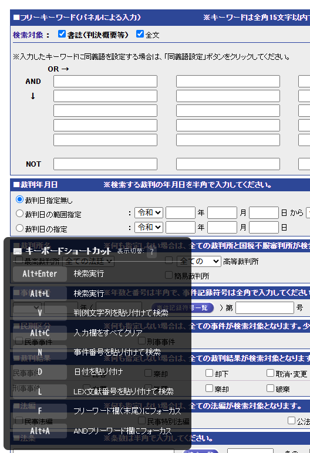
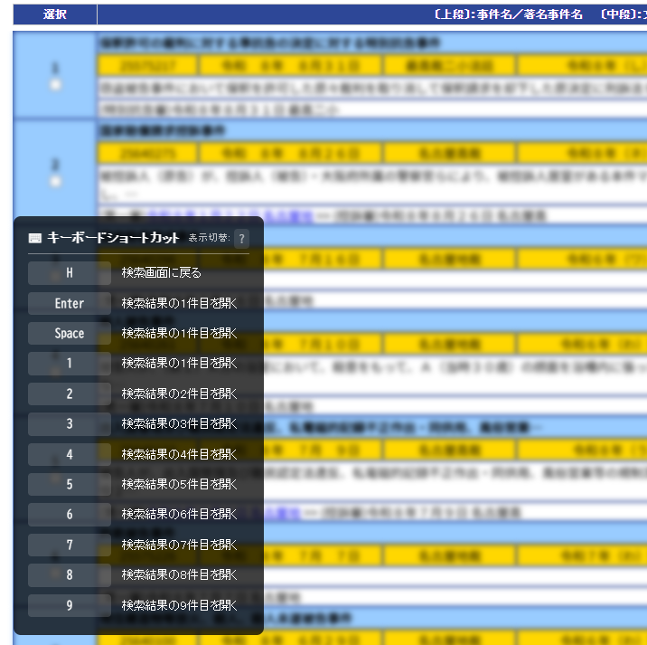
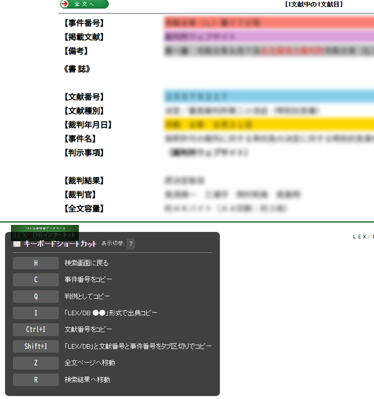

# LEX/DB Booster

LEX/DBをもっと使いやすくするためのブラウザ拡張機能です。

## スクリーンショット

#### 検索画面

#### 検索結果画面

- 各検索結果へのジャンプキーを追加
- 検索結果が1件のみであれば自動で選択
- 検索結果を着色して見やすく

#### 詳細画面

- 各種ショートカットキーを追加
    - 事件番号・判例・LEX/DB文献番号などのコピー用
    - 全文ページへの移動キー
- 事件番号・文献・備考などを先頭に表示
- 文献番号などの行に着色
